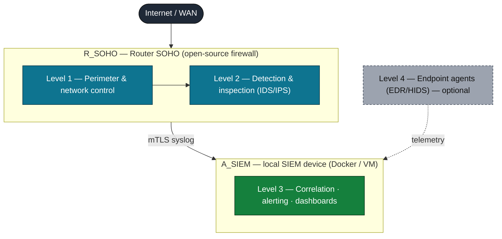

# uSOC — A Micro-SOC Concept for SOHO Environments

> **Concept & implementation reference.** This repository documents the
> **µSOC (micro Security Operations Center)** — an integrated, privacy-preserving
> cybersecurity architecture designed for **Small Office / Home Office (SOHO)**
> environments — and maps that concept, component by component, onto a working
> open-source reference implementation.

[-yellow.svg)](#bilingual-documentation)

---

## What this repository is

SOHO networks have become critical nodes in modern supply chains and remote-work
ecosystems, yet they remain dependent on consumer-grade routers and ad-hoc
security. Enterprise SOC, SOC-as-a-Service and MDR offerings exist, but their
cost, complexity and architectural assumptions are misaligned with SOHO
constraints (a handful of heterogeneous devices, no dedicated IT staff, strict
privacy expectations).

The **µSOC** answers that gap: a constrained but coherent SOC that delivers a
minimal, useful set of SOC functions — telemetry collection, detection,
prioritized alerting, basic triage and guided response — using lightweight
open-source components, near-zero-touch setup, local-first data handling, and an
interface aimed at non-expert users.

This repository contains **two layers**:

1. **The concept** — the theory, threat model, formal definition, architecture,
   telemetry/normalization model, detection-and-response engine, and the
   non-expert interaction model, derived from the underlying academic work.
2. **The implementation mapping** — how each conceptual element corresponds to a
   concrete artifact in the open-source reference implementation, so the design
   can be studied, reproduced, and extended.

It is **documentation, not a deployable product**: it carries prose, diagrams and
illustrative snippets. For full, runnable code, see the reference implementation
(below).

---

## The µSOC in one picture

Formally, the µSOC is defined as:

> **µSOC = { R_SOHO, A_SIEM, E_EDRoptional }**

where **R_SOHO** is the Router SOHO (firewall, IDS/IPS, IP/DNS reputation
filtering, passive telemetry), **A_SIEM** is the local SIEM device (collection,
normalization, correlation, alerting), and **E_EDR** denotes optional endpoint
agents. An optional cloud overlay and an optional AI augmentation layer compose
with R_SOHO and A_SIEM respectively without changing the core design.

---

## Documentation map

Read in order, or jump to a topic. All documents live under
[`docs/en/`](./docs/en/).

| # | Document | Topic |
|---|----------|-------|
| 00 | [Overview](./docs/en/00-overview.md) | What the µSOC is, design principles, how to read this repo |
| 01 | [Problem & threat model](./docs/en/01-problem-and-threat-model.md) | Why SOHO is hard; adversary classes; gap analysis |
| 02 | [The µSOC concept & formal definition](./docs/en/02-usoc-concept-and-definition.md) | µSOC vs. SOC/SOCaaS/MDR; formal model |
| 03 | [Architecture overview](./docs/en/03-architecture-overview.md) | The four functional levels; cloud & AI overlays |
| 04 | [Telemetry & normalization](./docs/en/04-telemetry-and-normalization.md) | Edge normalization; ECS v8; ingest pipeline |
| 05 | [Detection, correlation & response](./docs/en/05-detection-correlation-response.md) | Perimeter + SIEM detection; MITRE ATT&CK; response hierarchy |
| 06 | [User interaction & playbooks](./docs/en/06-user-interaction-and-playbooks.md) | Dashboards; guided response; Sigma+playbooks; optional AI |
| 07 | [Implementation mapping](./docs/en/07-implementation-mapping.md) | Concept → concrete code artifacts (the bridge) |
| 08 | [Deployment modes](./docs/en/08-deployment-modes.md) | Integrated (active) vs. passive (capture sensor) |
| 09 | [Scenarios & limitations](./docs/en/09-scenarios-and-limitations.md) | Standard coverage; required post-install personalization |
| 99 | [References](./docs/en/99-references.md) | Source works and standards |

Diagrams (Mermaid sources) are in [`diagrams/`](./diagrams/).

---

## Reference implementation

The µSOC concept is realized by an open-source, four-tier platform. This repo
references that codebase rather than duplicating it — use it for full,
runnable code, detailed study, or further development:

- **Reference implementation (open-source, MPL-2.0):**
  [`github.com/cybrd0ne/suru-foss`](https://github.com/cybrd0ne/suru-foss)

The conceptual levels map onto the implementation tiers as follows (full detail
in [document 07](./docs/en/07-implementation-mapping.md)):

| µSOC level | Reference-implementation tier |
|------------|-------------------------------|
| Router SOHO — perimeter (Level 1) | `tier1-perimeter/` |
| Router SOHO — detection (Level 2) | `tier1-perimeter/` + `tier2-telemetry/` |
| SIEM device (Level 3) | `tier3-core/` |
| Endpoint agents (Level 4, optional) | `tier2-telemetry/` endpoint agents |
| Operations / control plane | `tier4-operations/` |

---

## Bilingual documentation

This concept is documented in **English** and **Romanian**.

- **English** (`docs/en/`) — published.
- **Romanian** (`docs/ro/`) — **held back from publication.** The Romanian
  edition is written and maintained locally but is intentionally excluded from
  version control until it is approved for release. See
  [`.gitignore`](./.gitignore) for the one-line unblock procedure.

---

## License

This work is licensed under the
**[Creative Commons Attribution 4.0 International (CC BY 4.0)](./LICENSE)** license.
You may share and adapt the material for any purpose, including commercially,
provided you give appropriate credit.

When citing this concept in academic work, please attribute the µSOC architecture
and this reference repository.
