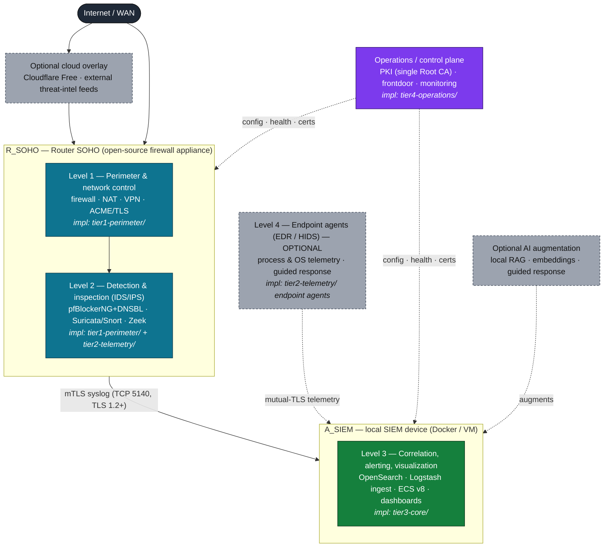

# 03 — Architecture Overview

The µSOC is organized as a small number of **independent functional levels**, each
corresponding to a distinct degree of visibility, control and response. Levels can
be deployed gradually and operate autonomously, which is essential in SOHO
settings where the simultaneous availability of every component cannot be
guaranteed. This document describes the design principles, the four functional
levels, the optional overlays, and the graceful-degradation property.

> Formal definition (developed in [document 02](./02-usoc-concept-and-definition.md)):
> **µSOC = { R_SOHO, A_SIEM, E_EDRoptional }**.

---

## 1. Five design principles

The architecture is dimensioned around five principles, each derived directly from
documented SOHO constraints (limited data volume, heterogeneous consumer devices,
non-expert users, chronic lack of timely patching, and the need to keep data
local for privacy).

1. **Security by default.** The initial configuration is restrictive, applying
   established best practice (CIS-aligned baselines) with a default-deny firewall
   policy and explicit, granular exceptions. With minimal effort and predefined
   configurations, a SOHO user or business obtains a baseline security platform
   that addresses the minimal needs of any deployment.

2. **Data minimization & local-first privacy.** Security telemetry is processed
   and stored locally. This applies the privacy constraints of SOHO environments
   directly: there is no implicit flow of raw data to cloud platforms or external
   parties.

3. **Near-automatic operation.** Configuration, updates and detection-rule
   management are automated, removing the dependence on local expertise or
   specialized staff. The components are open-source, community-maintained, and
   resilient — cost-effective and proven over time.

4. **Minimal hardware.** Every component runs on consumer-grade hardware (a
   mini-PC or a dedicated low-power appliance) or as a VM — preferably as
   resource-bounded Docker containers using the modest resources already present
   in a SOHO organization.

5. **Modularity & flexibility.** A minimal deployment is possible, and the
   architecture scales up when needed or as the security function matures —
   including extension toward advanced SOCaaS-style capabilities (SOAR, MSSP)
   without re-architecting the core.

Because it is flexible and scalable, the architecture can be adapted to the
available hardware capacity and to the technical proficiency of the SOHO operator.

---

## 2. The four functional levels

### Level 1 — Router SOHO: perimeter & network control

A central, indispensable element of the architecture is a dedicated device — the
**Router SOHO (R_SOHO)** — implemented preferably as an open-source network
firewall running on dedicated low-power x86 hardware or an optimized ARM device.
It directly addresses the vulnerabilities native to vendor-supplied consumer
routers: outdated firmware, insecure default configurations, and the absence of
robust automatic-update mechanisms.

If replacing the ISP-provided router (CPE) is not possible, the CPE is configured
in **bridge mode** with minimal services enabled (no DNS, DHCP, or other
supplementary services that expand the attack surface), and the Router SOHO takes
over all perimeter traffic control. Where even bridge mode is unavailable, the
device can operate **passively as a capture sensor** (see
[document 08](./08-deployment-modes.md)).

The baseline Router SOHO configuration includes:

- **Restrictive default firewall** — default-deny on the WAN interface, granular
  permissions on the LAN interface; management services (SSH, web UI) reachable
  only from the local network.
- **Restrictive-by-default services** — all non-essential services disabled
  (UPnP, SNMP, vendor cloud services, WAN-side remote management); IPv6 with an
  explicit firewall; self-signed certificates replaced by ACME-managed PKI.
- **Automatic base-OS / package patching** — reducing the exposure window
  documented for standard SOHO routers.
- **Certificate management via ACME / Let's Encrypt** — TLS certificates for
  exposed interfaces are issued and renewed automatically. Note the CA/Browser
  Forum certificate-transparency requirement: public-CA certificates are logged
  publicly, so a public CA should be used **only for publicly exposed services**;
  internal/confidential services use the platform's own CA.

> **Implementation:** `tier1-perimeter/` (firewall config, certificate handling,
> deploy driver). Full code: `github.com/cybrd0ne/suru-foss`.

### Level 2 — Detection & inspection (IDS/IPS integrated into Router SOHO)

Intrusion-detection functions are integrated directly into the Router SOHO,
exploiting the ability of open-source firewall platforms to run additional
security packages without separate hardware. The components are:

- **pfBlockerNG + DNSBL** — IP and DNS reputation filtering (reputation feeds,
  selective geo-blocks, C2 and ad-tracking domains). pfBlockerNG processes traffic
  **before any other component**, providing an efficient first filter that reduces
  the volume forwarded to later stages.
- **Suricata** (alternatively Snort), operated **inline as IPS (recommended)** or
  as passive IDS. Suricata is preferred over Snort for its multi-threaded
  architecture, which uses modest hardware more efficiently. Rules are updated
  automatically from **Emerging Threats Open (ET Open)** and compatible
  **Snort/Talos** rule sets, with a **SOHO-tuned selection**: categories that
  generate high false-positive volume (enterprise traffic, industrial/SCADA
  protocols, high-volume sessions) are disabled in the default profile to cut
  operational noise and triage load for the non-expert user. The objective is
  *efficient*, not exhaustive, detection.
- **Zeek** (formerly Bro), in passive monitoring mode, aggregating minimal
  security telemetry: TCP/UDP session logs, DNS logs, HTTP/TLS metadata (no
  decryption), file and certificate logs. Zeek does not raise alerts by default;
  it provides **structured telemetry for the SIEM**.

> **Implementation:** detection content in `tier2-telemetry/` (Suricata rule
> selection, Sigma rules, pfBlockerNG feeds); the engines run on the Level-1
> appliance via `tier1-perimeter/`.

### Level 3 — Local SIEM & event correlation

The third level is a dedicated **SIEM device (A_SIEM)**, implemented preferably as
a Docker container on a mini-PC or as a VM on an existing workstation, providing
portability, ease of update, and service isolation from the Router SOHO. It
performs:

- **Log collection** — the Router SOHO exports firewall, IDS (Suricata/Snort),
  pfBlockerNG and Zeek logs via syslog and/or local files.
- **Normalization & correlation** — logs are normalized into a unified schema
  (**ECS v8**), enabling multi-source correlation rules (see
  [document 04](./04-telemetry-and-normalization.md) and
  [document 05](./05-detection-correlation-response.md)).
- **Local storage** — all data is retained locally, honoring data minimization;
  there is no implicit flow of raw data to cloud or external environments.
- **Simplified interface** — a unified panel presents prioritized alerts and
  minimal investigation context, adapted to the non-expert user through
  predefined visualizations and response instructions (see
  [document 06](./06-user-interaction-and-playbooks.md)).

> **Implementation:** `tier3-core/` (OpenSearch + Dashboards, Logstash ingest
> pipelines, ECS templates).

### Level 4 — Optional endpoint agents (EDR / HIDS)

For workstations and local servers where installing a software agent is feasible,
the µSOC optionally integrates an **EDR (Endpoint Detection and Response)** or
**HIDS (Host-based Intrusion Detection System)** agent. The agent acts as a
**telemetry satellite**, providing internal visibility at the OS and process
level, complementing the network telemetry of Level 2 with:

- active processes and their process trees;
- per-process network connections;
- OS file-system modifications;
- authentication logs and OS security events.

Agent logs are normalized to the chosen schema and indexed in the SIEM device,
where they serve as a primary source for multi-event correlation rules. Beyond
telemetry, the agent is the channel through which the SIEM can execute
**automated response** at the endpoint — terminate a malicious process by PID,
quarantine a suspect file, block an IP locally, or fully isolate the device —
over an **encrypted, mutually-authenticated (certificate-based) channel**. This
secure channel also allows security functions to continue when devices are mobile,
outside the SOHO perimeter.

The endpoint level additionally supports **compliance and audit reporting**,
providing evidence of device security states (software versions, active policies,
authentication history) and documenting executed response actions for full
traceability.

> **Implementation:** optional endpoint agents under `tier2-telemetry/`; their
> telemetry is ingested and acted upon from `tier3-core/`.

---

## 3. Optional overlays

Two overlays extend the µSOC without altering the internal architecture. The base
µSOC is fully functional and effective **without either of them**.

- **Cloud protection (overlaps R_SOHO).** WAN traffic may optionally be routed
  through a free or commercial CDN / security-proxy platform (e.g. Cloudflare
  Free), providing volumetric DDoS protection, DNS reputation filtering, and a
  TLS reverse proxy. The free TLS certificate can secure authenticated inbound
  connections (e.g. remote access to internal resources). This component is
  optional; its absence does not reduce internal visibility or detection.

- **AI augmentation (overlaps A_SIEM).** An optional local AI-augmentation layer
  can add contextual reasoning, semantic search over the SIEM data, and
  natural-language guidance for the non-expert user. It **replaces no existing
  component** and is detailed in
  [document 06](./06-user-interaction-and-playbooks.md). The base µSOC operates
  fully and efficiently without it.

> The operations / control plane (`tier4-operations/`) — single-Root-CA PKI, the
> frontdoor entry point, and monitoring — sits across the levels rather than
> within one; see [document 08](./08-deployment-modes.md).

---

## 4. Graceful degradation

The detection-and-response engine is a graduated architecture of independent
levels with clearly delimited responsibilities and autonomous operation at each
level. This is essential in SOHO settings, where simultaneous availability of all
components cannot be guaranteed and partial service degradation must still
maintain a minimum level of protection:

- **Level 1 (Router SOHO)** operates as an autonomous preventive and reactive
  mechanism, independent of any external component. Blocking decisions are made
  locally, in real time, from predefined rules and automatically-updated
  reputation feeds — with no latency introduced by communication with the SIEM.
- **Level 3 (SIEM device)** operates as the multi-source correlation engine and
  incident orchestrator, but the perimeter keeps protecting even if the SIEM is
  unavailable.
- **Level 4 (endpoint agents)** continue to provide visibility and can keep
  reporting to a non-local SIEM even when the perimeter itself is compromised or
  offline.

The result is a design with **no single point of failure**: lower levels keep the
network protected even when higher levels are down.

---

*Previous: [02 — The µSOC concept & formal definition](./02-usoc-concept-and-definition.md)
 · Next: [04 — Telemetry & normalization](./04-telemetry-and-normalization.md)*
