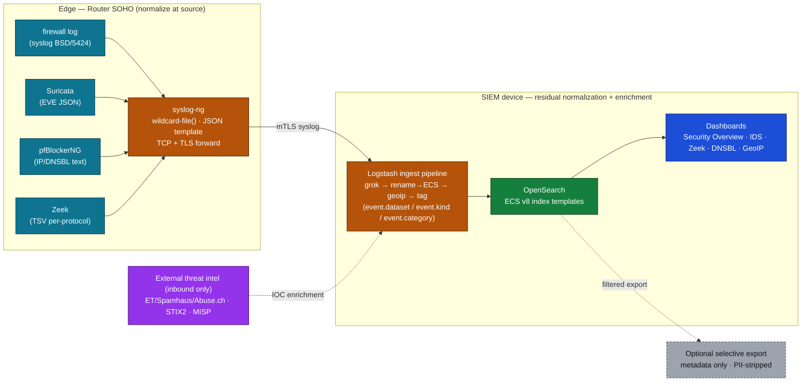

# 04 — Telemetry & Normalization

The telemetry layer is the connective tissue of the µSOC: it carries security
events from the heterogeneous sources at the **Router SOHO (R_SOHO)** and optional
endpoint agents to the **SIEM device (A_SIEM)**, transforming them along the way
into a single, consistent schema that makes cross-source correlation possible.
This document describes the design principle behind that layer, the sources and
their native formats, the choice of normalization schema, where transformation
happens, the SIEM ingest pipeline, and how optional cloud and threat-intelligence
enrichment fit the µSOC's data-minimization model (architecture §6.2).

---

## 1. Principle: normalize at the source

A foundational design choice of the µSOC is that **normalization of security
events should happen as close to the point of generation — at the edge — as
possible**, rather than being delegated entirely to the central SIEM
(architecture §6.2.1).

Doing the bulk of field extraction and schema mapping on the Router SOHO has
several consequences that matter in a SOHO context:

- It **lowers the resource footprint of the SIEM device**, which must run on
  modest hardware (a 4–8 GB mini-PC or a VM on an existing workstation).
- It **avoids heavy, real-time transformations** on the central node and the
  latency they introduce.
- It produces a **consistent representation regardless of the diversity or
  quantity of source devices** present on the SOHO network.

This matters most precisely because the generating devices are heterogeneous: the
native log formats differ structurally between the Router SOHO components
(firewall, IDS, DNS filtering, network telemetry), the optional endpoint agents,
and any external sources such as cloud services.

The telemetry flow is organized into three consecutive stages:

1. **Collection** — extracting the original events from local sources.
2. **Transformation & normalization** — structuring the fields according to a
   standardized schema.
3. **Ingestion** — delivering normalized events to the SIEM device for indexing
   and correlation.

Each stage can be configured to operate fully locally (air-gapped) or with the
option of selective export of aggregated metadata to an optional cloud platform,
respecting the principle of data minimization.

---

## 2. Telemetry sources and native export formats

The Router SOHO generates several independent log streams, each produced by a
distinct component, and they are homogeneous neither in format nor in delivery
mechanism (architecture §6.2.2):

| Source | Component | Native format |
|--------|-----------|---------------|
| Firewall | connection-state / rule logs | syslog BSD (RFC 3164) or RFC 5424 |
| IDS/IPS | Suricata (or Snort) | EVE JSON (`/var/log/suricata/eve.json`) |
| IP/DNS reputation | pfBlockerNG | dedicated text logs (`/var/log/pfblockerng/`) |
| Network telemetry | Zeek | per-protocol TSV (`conn.log`, `dns.log`, `ssl.log`, `http.log`, `files.log`) |

### Native export mechanisms and their limits

The Router SOHO platform offers two native log-export mechanisms:

- **Remote syslog (UDP/TCP)** — configurable from the admin interface; sends
  system, firewall, authentication and DHCP logs to an external syslog server.
  The default is BSD format (RFC 3164), reconfigurable to modern syslog
  (RFC 5424 with microsecond RFC 3339 timestamps). A documented limitation is
  decisive here: the platform's **native syslog truncates messages at 480 bytes**
  before transmission, which can corrupt Suricata alerts that carry extended
  fields.
- **Local text/JSON files** — most security components (Suricata, Zeek,
  pfBlockerNG) write structured logs directly to the Router SOHO filesystem.

To overcome the 480-byte truncation and guarantee complete export of the
structured logs, the µSOC adopts **`syslog-ng`** as a local collector installed as
an additional package on the Router SOHO. It watches the local files of each
component directly — using a `wildcard-file()` source with continuous tailing
(`follow-freq`) — and re-transmits them to the SIEM device over TCP, with optional
TLS. Keeping the original local files in place provides **redundancy** if the SIEM
device is temporarily unavailable, allowing later replay.

---

## 3. The normalization schema

### 3.1 Historical reference standards

The need for a common vocabulary for security events produced several competing
log-representation standards over time (architecture §6.2.3):

- **CEF — Common Event Format** (ArcSight, 2006): syslog-based key–value format,
  widely adopted in traditional SIEM ecosystems.
- **LEEF — Log Event Extended Format** (IBM, 2012): a QRadar-optimized variant
  with CEF-like syntax but slightly different field semantics.
- **CIM — Common Information Model** (Splunk): a proprietary normalization schema
  organized around hierarchical data models, used as the basis for correlation in
  Splunk.

These contributed to interoperability within their respective ecosystems but are
partly proprietary, are not governed by a public standards body, have incomplete
coverage of modern event types (IoT, cloud, container), and are not aligned with
the native JSON produced by current open-source tooling (Suricata EVE JSON, Zeek
TSV).

### 3.2 Modern schemas: ECS and OCSF

Two open-source initiatives address the limitations of the historical formats:

- **Elastic Common Schema (ECS)** — an open-source standard, originally developed
  by Elastic and now community-governed, that defines a consistent set of JSON
  fields for security, network, system and application events. ECS organizes
  fields into hierarchical semantic groups and enforces strict typing and naming
  conventions.
- **Open Cybersecurity Schema Framework (OCSF)** — an open-source initiative led
  by AWS with industry partners, defining a taxonomic, technology-agnostic event
  model applicable to both cloud and on-premises environments.

### 3.3 Why the µSOC chooses ECS v8

The µSOC adopts **ECS v8** as its unified normalization schema because it offers
direct compatibility with the entire open-source SIEM stack the architecture
relies on — OpenSearch (via the `logstash-output-opensearch` plugin with
`ecs_compatibility`), Logstash/Filebeat, and similar tools. OCSF, while gaining
traction in cloud platforms, has limited support in the open-source SIEM tooling
the µSOC uses; the prevailing direction in that ecosystem is to *map* OCSF to ECS
rather than adopt it natively.

ECS index templates ensure documents stored in OpenSearch conform to the schema,
preventing mapping errors and enabling consistent correlation across sources whose
native formats are radically different (Suricata EVE JSON, Zeek TSV, the
firewall's BSD syslog, pfBlockerNG plain text).

| Characteristic | CEF | LEEF | CIM | **ECS** | OCSF |
|----------------|-----|------|-----|---------|------|
| Data model | flat key–value | flat key–value | hierarchical, proprietary | **hierarchical JSON, open** | taxonomic JSON, open |
| Open standard | partial | no | no | **yes** | yes |
| OpenSearch / Elastic support | limited | no | no | **native** | indirect (via ECS) |
| Logstash support | yes | partial | no | **native** | experimental |
| SOHO / IoT suitability | weak | weak | medium | **good** | medium |

The canonical ECS field groups used across all `suru-*` indices include
`event.*`, `source.*`, `destination.*`, `network.*`, `host.*`, `user.*`,
`process.*`, `threat.*`, `rule.*`, `dns.*`, `http.*`, and `tls.*`. By convention
the connection initiator is always mapped to `source.ip` / `source.port` and the
responder to `destination.ip` / `destination.port` (with optional `client.*` /
`server.*` when the role is known).

---

## 4. Transformation at the source

Raw collection is not sufficient: each source's native fields must be transformed
into the unified schema before indexing. The transformation is organized as a
collection of per-source mappings, each addressing one source (architecture
§6.2.4):

- **Firewall** — parses syslog BSD / RFC 5424, extracts interface, action
  (pass/block), protocol, source/destination addresses and ports, and maps them to
  ECS (`source.ip`, `destination.ip`, `network.protocol`, `event.action`).
- **Suricata** — parses the native EVE JSON, extracts alert fields
  (`alert.signature`, `alert.severity`, `alert.category`), flow metadata and
  threat indicators, mapping them into the ECS `threat.*` and `rule.*` groups.
- **pfBlockerNG** — parses IP-block and DNSBL logs, extracts the blocked domain or
  IP, the reputation list, and the block type, mapping into `threat.indicator.*`
  and `dns.*`.
- **Zeek** — imports the TSV files, deserializes the columns specific to each log
  type, and normalizes to ECS — for example `ts → @timestamp`,
  `id.orig_h → source.ip`, `id.resp_h → destination.ip`,
  `service → network.protocol`.

The preferred model is **distributed execution**: base field processing and the
mapping to ECS are performed locally on the Router SOHO via `syslog-ng` with
structured JSON templates, reducing both the volume of data transmitted and the
processing burden on the SIEM device.

> *Illustrative only — a minimal field-mapping fragment (not a full pipeline):*
>
> ```ruby
> # Zeek conn.log → ECS (conceptual)
> mutate {
>   rename => {
>     "id.orig_h" => "[source][ip]"
>     "id.resp_h" => "[destination][ip]"
>     "service"   => "[network][protocol]"
>   }
> }
> date { match => ["ts", "UNIX"] target => "@timestamp" }
> ```
>
> Full, runnable pipelines live in the open-source reference implementation —
> `tier3-core/` at <https://github.com/cybrd0ne/suru-foss>.

---

## 5. The SIEM ingest pipeline

At the SIEM device, events arriving from the Router SOHO (already partly
normalized at the source) pass through an ingest pipeline that performs the
residual transformations, metadata enrichment, and ECS-conformance validation.
The pipeline follows a staged processor-chain model (architecture §6.2.5):

1. **JSON parsing / field extraction** — for logs that arrive as syslog text
   (firewall BSD, pfBlockerNG), a `grok` processor extracts the structured fields
   from the raw message into intermediate fields.
2. **Re-indexing to ECS** — a `rename`/`set` processor maps the intermediate
   fields to the corresponding ECS groups (`src_ip → source.ip`,
   `dst_port → destination.port`, `rule_id → rule.id`).
3. **GeoIP enrichment** — for external IP addresses (a WAN-side `source.ip` or
   `destination.ip`), a `geoip` processor adds `source.geo.*` fields (country,
   ASN, coordinates), enabling geographic correlation and anomaly detection.
4. **Classification & tagging** — context metadata is added: `event.dataset`
   (the source type: `pfsense.firewall`, `suricata.eve`, `zeek.conn`,
   `pfblockerng.ip`), `event.kind` (`event` or `alert`), and `event.category`
   (`network`, `intrusion_detection`).
5. **Score normalization & deduplication** — for high-volume streams (Zeek
   connection logs), aggregation reduces redundancy before indexing, retaining
   only the sessions relevant to security.

The clean **separation of responsibilities** — normalization at the source
(`syslog-ng` on the Router SOHO) versus enrichment in the SIEM pipeline — is what
lets the SIEM device operate on modest hardware (a 4–8 GB mini-PC) without being
overwhelmed by the full volume of raw logs.

### The `@timestamp` invariant

A concrete detection-consistency rule underpins the whole pipeline:
**`@timestamp` must be the event's own time, parsed from the log itself — never
the ingest/collector time.** A wrong `@timestamp` silently breaks everything
detection depends on: cross-source correlation, event sequencing, alert/monitor
time windows, dashboard ranges, and — most damagingly — disk-buffer replay after
an outage. The Router SOHO runs a reliable syslog-ng disk buffer; after a SIEM
outage it replays hours of backlog, and if `@timestamp` were ingest time every
replayed event would collapse onto the replay wall-clock. The ingest pipeline
therefore preserves the in-payload event time (Suricata `timestamp`, Zeek `ts`,
the firewall's syslog header time) as `@timestamp`, while recording the ingest
time separately (e.g. `event.ingested`) for lag monitoring.

---

## 6. The complete telemetry flow



*(Source: [`diagrams/02-telemetry-flow.mmd`](../../diagrams/02-telemetry-flow.mmd).)*

End to end: on the Router SOHO, `syslog-ng` collects all log streams via file
monitoring, applies structured JSON templates for the base fields, and transmits
events to the SIEM device over TCP with TLS for in-transit encryption. On the SIEM
device, Logstash (or Filebeat with dedicated modules) performs residual processing
and the complete transformation to ECS before the documents reach the SIEM data
store. Automatically installed ECS index templates ensure correct field typing and
prevent the mapping conflicts documented for incompatible fields (for example a
string field colliding with an ECS object field).

Multi-source correlation — for example associating a Suricata alert with the
corresponding Zeek connection log and a pfBlockerNG block for the same source IP —
becomes possible precisely because the common fields `source.ip`,
`destination.ip`, `network.transport` and `@timestamp` are present, normalized to
ECS, across every event type.

---

## 7. Cloud, threat intelligence and contextual enrichment

The µSOC's telemetry layer is designed as a **bidirectional** interface to
external security context, but with a strict, asymmetric data-minimization model
(architecture §6.2.7).

### Inbound: threat-intelligence ingestion (always allowed)

The µSOC actively imports threat-intelligence (TI) feeds and integrates the
indicators into the processing pipeline, enriching telemetry with context about
known Internet threats before or at indexing time. Two integration points:

- **Reputation feeds integrated at the Router SOHO (pfBlockerNG)** — an unlimited
  number of external IP-reputation and DNSBL feeds, downloaded automatically at
  configurable intervals and applied as firewall block lists. Recommended SOHO
  sources include Emerging Threats IP blocklists, Spamhaus DROP/EDROP, the
  Abuse.ch family (Feodo Tracker, URLhaus, MalwareBazaar), AlienVault OTX, and
  Q-Feeds Community Edition. Because this happens at the edge, the block/log
  association with a known IOC is added to the log *before* it is exported,
  enriching context at the source.
- **STIX2 feeds integrated in the SIEM** — the SIEM natively ingests TI in STIX2
  (the OASIS standard), supporting IPv4/IPv6 addresses, DNS domains, and file
  hashes (MD5/SHA-1/SHA-256). For advanced privacy or sharing requirements (for
  example NIS2 contexts), the architecture allows a **local MISP** instance as a
  Docker container on the SIEM device. MISP acts as a local aggregator of external
  feeds and exposes a REST API from which the ingest pipeline can query IOCs for
  real-time enrichment — keeping all TI context inside the local perimeter.

### Outbound: selective export (optional, filtered, explicit)

Export of normalized events to an optional cloud SIEM or TI-sharing platform is
**metadata only** and passes through a mandatory pre-export filter stage that
strips potentially sensitive fields (queried DNS content, full URIs, user
identifiers) before anything leaves the local perimeter.

### The minimization guarantee

The two flows are deliberately separated: **TI ingestion is inbound-only** (the
µSOC downloads IOCs and stores them locally; it never exposes a local event or
internal IP to the feed provider), and **export is optional, filtered and
explicit**. This separation ensures the data-minimization principle and the
identified confidentiality requirements are fully respected, independent of the
TI configuration the user chooses.

### Flexible SIEM hosting

Because the architecture is modular, the SIEM device is not topologically bound to
the monitored perimeter. It may be hosted **locally on-premises** (preferred for
data minimization and latency), at a **dedicated off-site location** (a colocated
server or a managed-service provider), or in a **private/public cloud** for maximum
resilience. The latter two are especially relevant when the SOHO perimeter is
itself compromised or unavailable: a non-local SIEM continues to receive endpoint
(EDR) telemetry even when the perimeter component is down. Regardless of hosting,
**all inter-component transfer is encrypted** — TCP with TLS (minimum 1.2,
recommended 1.3) and mutual certificate authentication — a mandatory µSOC
requirement detailed in [08 — Deployment Modes](./08-deployment-modes.md).

---

*Prev: [03 — Architecture Overview](./03-architecture-overview.md) · Next: [05 — Detection, Correlation & Response](./05-detection-correlation-response.md)*
