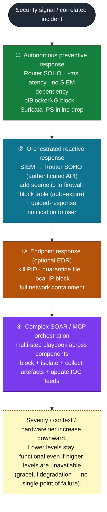

# 05 — Detection, Correlation & Response

The µSOC detection-and-response engine is the analytical heart of the
architecture. It is deliberately built as a **graduated, multi-level engine** in
which each level can operate autonomously, so that the partial degradation that
is normal in a SOHO environment — a powered-down SIEM device, an unreachable
endpoint, an Internet outage — never reduces protection to zero. This document
describes the three detection layers, the SIEM correlation engine, the
four-level automated-response hierarchy, and how the whole is anchored to the
MITRE ATT&CK framework. *(Source: architecture §6.3.)*

---

## 1. Principles and separation of responsibilities

In a traditional SOC, detection and response are concentrated in analyst teams
working over a central SIEM. The µSOC cannot assume continuous availability of
any single component, so its engine is decomposed into three functional levels
with clearly delimited responsibilities and **independent operating capability**
at each level *(architecture §6.3.1)*:

| Level | Component | Role | Dependency |
|-------|-----------|------|------------|
| 1 | **Router SOHO (R_SOHO)** | Autonomous preventive and reactive response at the perimeter — real-time, local block decisions | None (fully autonomous) |
| 2 | **SIEM device (A_SIEM)** | Multi-source correlation engine and incident orchestrator | Receives telemetry; can drive Level 1/3 |
| 3 | **Endpoint agents (E_EDR)** *(optional)* | Host/OS telemetry satellites; OS-level response in advanced configurations | Optional; complements network view |

The guiding rule is that **the closer to the attack surface, the more autonomous
the decision**: Level 1 takes block decisions locally, in real time, with no
latency introduced by communication with the SIEM, and those decisions cannot be
disabled by an attacker who has compromised the SIEM device.

---

## 2. Perimeter detection layer — Router SOHO

The perimeter layer combines three complementary detection techniques, ordered
from cheapest/earliest to deepest. Each processes traffic at a different point
and exports its events, ECS-normalized, to the SIEM device for correlation.

### 2.1 Reputation-based detection and blocking — pfBlockerNG

pfBlockerNG provides the **first line** of detection and automatic response,
filtering traffic *before* it is evaluated by any other component
*(architecture §6.3.2.1)*. It periodically downloads and processes external
reputation feeds — by default every 24 hours — applying deduplication, CIDR
aggregation, and a **Reputation-Max** scoring strategy so that only
high-confidence malicious indicators are blocked.

Default feeds, selected for the documented SOHO threat profile:

- **Spamhaus DROP/EDROP** — IP blocks owned or leased by criminal organizations;
  high coverage for C2 and residential-proxy traffic.
- **Emerging Threats** blocklists (`compromised-ips.txt`, `emerging-Block-IPs.txt`)
  — aggregated from DShield Top Attackers, Abuse.ch; updated daily.
- **Abuse.ch Feodo Tracker** — active C2 infrastructure for Emotet, TrickBot,
  Cobalt Strike, QakBot; updated hourly.
- **Q-Feeds Community / OSINT** — European feeds focused on phishing, botnets and
  malicious infrastructure.

At the DNS layer, the **DNSBL** module blocks malicious domains *before any
connection is established*, eliminating an entire class of vectors (phishing,
drive-by download, algorithmically-generated C2 domains) without packet
inspection. **MaxMind GeoLite2** enables geo/ASN-level blocking of inbound
traffic from address blocks associated with high malicious-activity rates. Every
block is logged and exported to the SIEM, contributing to correlation telemetry.

> **MITRE ATT&CK:** TA0011 Command & Control (T1071 Application Layer Protocol),
> TA0043 Reconnaissance (T1590 Gather Victim Network Information).

### 2.2 Signature-based detection and prevention — Suricata / Snort IPS

Suricata is operated **inline as an IPS**, intercepting packets in the traffic
flow and applying detection rule sets with real-time blocking
*(architecture §6.3.2.2)*. Where pfBlockerNG decides on the **reputation** of
addresses and domains, Suricata analyzes the **content and behavior** of flows,
detecting threat patterns that static reputation cannot identify. Suricata is
preferred over Snort for its multi-threaded architecture, which uses modest
hardware more efficiently.

Rule-set selection is tuned to **minimize operational noise and false-positive
rate** — a structural problem documented for IDS deployments in heterogeneous
traffic:

- **Emerging Threats Open (ET Open)** — broad coverage of current threats
  (router exploits, C2 traffic, IoT botnets, DNS exfiltration), updated daily.
- **Snort/Talos community rules** (Suricata-compatible) — Cisco Talos coverage of
  active vulnerabilities and documented campaigns.
- **SOHO-oriented selection** — rules that generate large volumes of
  false positives in SOHO settings (enterprise traffic, SCADA/industrial
  protocols, high-volume session rules) are **disabled in the default profile**,
  reducing triage burden and keeping alerts relevant for the non-expert user.

Suricata maintains a **temporary host-based block table** with configurable
auto-expiry, allowing reactive blocks of limited duration and reducing the risk
of permanently blocking legitimate addresses with transient anomalous behavior.
Its native IP-reputation module can hold local reputation lists, optionally
synchronized with the SIEM's threat-intelligence feeds, applying a pre-scoring
pass before the full rule engine runs.

> **MITRE ATT&CK:** TA0001 Initial Access, TA0011 Command & Control (T1071),
> TA0005 Defense Evasion.

### 2.3 Passive behavioral detection — Zeek

Zeek completes the perimeter arsenal with a **passive** perspective on network
traffic — no direct blocking, but analytical depth that signature engines lack
*(architecture §6.3.2.3)*. Capabilities relevant to the SOHO threat profile:

- **Scan detection** — TCP/UDP connection-pattern analysis identifies port scans,
  network sweeps and service probes characteristic of the reconnaissance phase
  (TA0043).
- **DNS anomalies** — anomalous NXDOMAIN response rates, high subdomain entropy,
  atypical TTL variation, and query patterns characteristic of
  domain-generation algorithms (DGA) and DNS tunneling.
- **TLS certificate profiling** — metadata extracted from TLS negotiation
  (`ssl.log`) identifies self-signed, expired, or cryptographically weak
  certificates, and signatures associated with C2 infrastructure.
- **Exfiltration detection** — TCP session size/duration (`conn.log`) correlated
  with service type detects abnormal-volume or abnormal-frequency transfers
  (TA0010 Exfiltration).

Zeek logs are exported as structured TSV, ECS-normalized, and indexed in the
SIEM, where they are a **primary source** for behavioral correlation rules.

---

## 3. SIEM correlation and advanced detection

The SIEM device unifies telemetry from all components and applies detection and
correlation that exceed the individual capabilities of the perimeter components
*(architecture §6.3.3)*.

### 3.1 The six SIEM maturity levels in the µSOC

The µSOC maps the progressive-use maturity model of modern SIEM platforms onto
its own architecture. Levels 1–4 are achievable on minimal hardware
(µSOC architecture Level 1); Levels 5–6 require extended hardware
(µSOC architecture Level 2):

| SIEM level | Capability | µSOC notes |
|-----------|------------|------------|
| 1 — Collect & index | Receive, ECS-normalize and index all telemetry | Retrospective search and investigation |
| 2 — Analyze & visualize | Predefined dashboards + ad-hoc search | Manual threat hunting |
| 3 — Compliance monitoring | Auth logs, config changes, access as **audit trails**; deviation alerts | Reporting for NIS, GDPR, ISO 27001 |
| 4 — Sigma rule-based detection | Continuous Sigma detections with automatic MITRE ATT&CK mapping | Works on minimal hardware; low, deterministic processing |
| 5 — Anomaly detection + TI | ML behavioral baselines + threat-intelligence contextualization | Needs extended hardware; finds zero-day / novel campaigns |
| 6 — Incident Response | Full automated incident correlation + response orchestration | **The µSOC's maximum-maturity objective** |

**Sigma** is a platform-independent public standard for expressing detection
logic, which makes rules portable and reusable across SIEM back-ends. Each Sigma
detection produces an indexed event with automatic mapping to MITRE ATT&CK
tactics, techniques and sub-techniques. A minimal illustrative excerpt
*(full rule packs live in the reference implementation, `tier2-telemetry/`)*:

```yaml
# illustrative Sigma excerpt — not a complete rule
title: Suricata C2 Communication Detected — SOHO Router
tags: [attack.command_and_control, attack.t1071]
level: high
# the µSOC extends Sigma with non-expert response context (see doc 06)
```

### 3.2 Multi-source correlation engine

For complete detection — and to unify disparate events into a single incident —
the SIEM implements a **multi-source correlation engine** that defines detection
rules over the aggregation of otherwise-disconnected events
*(architecture §6.3.3.2)*. A canonical µSOC correlation rule:

> Within time window **T**, if all of: **(1)** a pfBlockerNG block on source IP
> **X**, **(2)** a Suricata alert with `threat.tactic.id = TA0011` (Command &
> Control) on the same IP **X**, and **(3)** a Zeek DNS log with an anomalous
> NXDOMAIN rate from an internal host — then raise a **high-priority incident**
> with full aggregated context.

The engine applies **temporal constraints** (a configurable correlation window)
and **field constraints** (same `source.ip`, same `destination.port`, same
`host.name`) to reduce false positives at the incident level. Shared ECS fields
(`source.ip`, `destination.ip`, `network.transport`, `@timestamp`) across all
event types are what make this correlation possible. Documented implementations
report mean-time-to-detect (MTTD) for multi-event incidents falling from hours to
under 90 minutes through automatic correlation versus manual alert analysis.

---

## 4. Automated-response architecture

Incident response follows a **graduated hierarchy of automation** with four
levels, ordered by incident complexity, response latency, and hardware
dependency *(architecture §6.3.4)*.



*Diagram source: [`diagrams/03-response-hierarchy.mmd`](../../diagrams/03-response-hierarchy.mmd).*

1. **Autonomous preventive response (Router SOHO — no latency).** Operates
   exclusively at the perimeter, independent of the SIEM, with millisecond-order
   latency. pfBlockerNG blocks on reputation-feed updates and Suricata inline IPS
   drops on signature triggers are autonomous mechanisms that **cannot be
   disabled by an attacker who has compromised the SIEM device**.

2. **Orchestrated reactive response (SIEM → Router SOHO).** For scenarios where
   perimeter detection did not identify the threat (a new IP, a signature absent
   from the current rule set) but SIEM correlation built enough context to
   justify a block. On a SIEM rule with a configured severity (recommended score
   **≥ 60/100** for automatic response), a script issues an authenticated API
   call to the Router SOHO adding the source IP to the firewall block table:

   ```sh
   # illustrative — orchestrated block with auto-expiry
   pfctl -t blocked_ips -T add "$SOURCE_IP"
   ```

   The block has a configurable duration with auto-expiry, preventing unbounded
   accumulation of dynamic rules. In parallel, a **guided-response notification**
   is sent to the non-expert user (see [doc 06](./06-user-interaction-and-playbooks.md)).

3. **Endpoint response (optional EDR).** For threats that crossed the network
   perimeter and manifested on a monitored host. Capabilities depend on the
   chosen agent: kill a malicious process by PID, quarantine a suspicious file,
   block an IP locally on the host firewall, or perform **full network
   containment** (controlled disconnection while keeping the SIEM channel open
   for investigation and artifact collection). Full isolation is the strongest
   endpoint mechanism available without additional components, appropriate for
   confirmed malicious activity (ransomware, lateral movement).

4. **Complex SOAR / MCP orchestration (additional component).** Corresponds to
   SIEM maturity Level 6 and the extended-hardware µSOC configuration. A SOAR
   component (or orchestration API) executes multi-step playbooks coordinating
   simultaneous actions across components: block IP on the Router SOHO, isolate
   the compromised endpoint, notify the user with full incident context, collect
   investigation artifacts, and automatically update local IOC feeds with the
   newly identified indicator. Optional AI-driven contextual orchestration of
   this level is described in [doc 06](./06-user-interaction-and-playbooks.md).

All inter-component response channels use **mutually-authenticated, encrypted
communication** (see [doc 08](./08-deployment-modes.md)). The hierarchy embodies
**graceful degradation**: lower levels keep protecting even when higher levels
are unavailable.

---

## 5. MITRE ATT&CK correlation

Correlating detection and response capabilities onto the MITRE ATT&CK framework
transforms operations from a **reactive, alert-driven** model into a unified,
**adversary-driven** defensive picture that can trace the full flow of a detected
attack *(architecture §6.3.5)*. Mapping detection rules onto the ATT&CK matrix
gives a clear, quantifiable view of what is covered and — more importantly — what
is missing. The SIEM generates interactive heat maps showing rule density per
technique, allowing new detections to be prioritized in under-covered areas, and
turning the vague question *"are we protected?"* into an auditable metric.

Coverage of SOHO-relevant tactics is evaluated per component, summarizing the
source's coverage table *(architecture §6.3.5, Table 4)*:

| MITRE tactic | Router SOHO (pfBlockerNG + Suricata) | Zeek (passive) | SIEM (Sigma + ML) | EDR (optional) |
|--------------|:---:|:---:|:---:|:---:|
| Reconnaissance (TA0043) | Partial (WAN scans blocked) | Yes (scan detection) | Yes (Zeek correlation) | No |
| Initial Access (TA0001) | Yes (firmware exploits, phishing DNS) | Partial (TLS anomalies) | Yes (Sigma CVE rules) | Partial |
| Execution (TA0002) | No | No | Partial (Sigma) | Yes (processes, shell) |
| Persistence (TA0003) | No | No | Partial (Sigma) | Yes (system changes) |
| Defense Evasion (TA0005) | Partial (IP reputation) | Partial (TLS/DNS) | Yes (ML anomalies) | Yes |
| Command & Control (TA0011) | Yes (IP/DNSBL/C2 signatures) | Yes (DGA, DNS tunneling) | Yes (multi-source correlation + TI) | Partial |
| Exfiltration (TA0010) | Partial (destination block) | Yes (session volume) | Yes (Zeek + ML correlation) | Yes |
| Impact (TA0040) | Partial (traffic block) | Partial (volume) | Yes (alerting) | Yes (endpoint isolation) |

Two conclusions follow. First, **complete coverage requires integrating all
levels** — no single component covers the full spectrum. Second, the highest
coverage for **Initial Access** and **Command & Control** — the tactics most
frequent in campaigns targeting SOHO routers — is provided **at the perimeter
(Router SOHO)**, validating the architectural decision to concentrate fast,
automatic response closest to the attack surface. Anchoring correlation rules to
empirically-documented adversary tactics marks the transition from an
alert-driven µSOC to an **adversary-driven** one.

---

*Prev: [04 — Telemetry & Normalization](./04-telemetry-and-normalization.md) · Next: [06 — User Interaction & Playbooks](./06-user-interaction-and-playbooks.md)*
