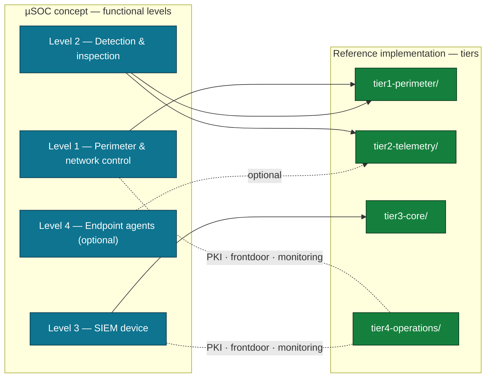

# 07 — Implementation Mapping

This document is the bridge between the **µSOC concept** and its **open-source
reference implementation**. It maps each conceptual element to the concrete
artifact that realizes it, so the architecture can be studied, reproduced, and
extended from real code.

- **Concept** — defined in documents [02](./02-usoc-concept-and-definition.md)–[06](./06-user-interaction-and-playbooks.md).
- **Reference implementation** — the open-source, MPL-2.0 platform at
  **[github.com/cybrd0ne/suru-foss](https://github.com/cybrd0ne/suru-foss)**.

Throughout this repository, code is shown only as short illustrative snippets.
For full, runnable code, follow the paths below into the reference
implementation.

---

## 1. Levels → tiers

The µSOC's four functional **levels** (concept) are realized by the reference
implementation's four **tiers** (code). The mapping is deliberately close but not
one-to-one: the Router SOHO concept spans two tiers, and the operations/control
plane is an implementation tier that supports all levels.

| µSOC concept element | Reference-implementation tier | What lives there |
|----------------------|-------------------------------|------------------|
| **R_SOHO** — Level 1 (perimeter & network control) | `tier1-perimeter/` | Router/firewall config, deploy driver (SSH, no Docker on the router), syslog-ng forwarder, mTLS client cert |
| **R_SOHO** — Level 2 (detection & inspection) | `tier1-perimeter/` + `tier2-telemetry/` | Suricata/Zeek runtime config on the router; the **detection content** (rule selection, Sigma, pfBlockerNG feeds) that is rendered onto it |
| **A_SIEM** — Level 3 (SIEM device) | `tier3-core/` | OpenSearch + Dashboards, Logstash ingest pipelines, ECS v8 templates, dashboard saved objects |
| **E_EDR** — Level 4 (endpoint agents, optional) | *(conceptual — see §3)* | Network-centric focus in the open-source reference; EDR integration is described conceptually |
| **Operations / control plane** | `tier4-operations/` | Single Root-CA PKI, nginx frontdoor (sole LAN entry point), Prometheus/Grafana/Alertmanager monitoring |

---

## 2. Element-by-element mapping

### 2.1 Level 1 — Perimeter & network control → `tier1-perimeter/`

| Concept (doc 03 §Level 1) | Path | Notes |
|---------------------------|------|-------|
| Open-source firewall, default-deny, LAN-only management | `tier1-perimeter/pfsense/`, `tier1-perimeter/templates/` | pfSense / OPNsense; config rendered from templates |
| Deploy driver (SSH, no Docker on router) | `tier1-perimeter/scripts/deploy.sh` + `scripts/lib/` + `scripts/platforms/<platform>.sh` | Pure orchestrator; all network I/O via the platform driver |
| syslog-ng forwarder (edge normalization) | `tier1-perimeter/syslog-ng/` | wildcard-`file()` sources, JSON templates, TCP+TLS to the SIEM |
| mTLS client certificate | `tier1-perimeter/certs/` (cert signed by the Root CA) | See PKI in §2.5 |

The deploy entry point is the perimeter Makefile (e.g. `make deploy-full
PLATFORM=pfsense`).

### 2.2 Level 2 — Detection & inspection → `tier1-perimeter/` + `tier2-telemetry/`

Detection **content** is authored in `tier2-telemetry/` and rendered onto the
router's Suricata/Zeek/pfBlockerNG at deploy time.

| Concept (doc 05 §6.3.2) | Path | Notes |
|-------------------------|------|-------|
| pfBlockerNG + DNSBL reputation/geo/C2 filtering | `tier2-telemetry/pfblockerng/` | Feed selection (Spamhaus, Emerging Threats, Abuse.ch, …), DNSBL config |
| Suricata IPS rule selection (ET Open + Talos, SOHO-tuned) | `tier2-telemetry/suricata/` | Enable/disable profiles tuned to cut false positives for SOHO |
| Behavioral / Sigma detection rules (MITRE-mapped) | `tier2-telemetry/sigma/`, `tier2-telemetry/sigma-rules/` | Platform-independent Sigma; carry the guided-response custom fields (doc 06) |
| Zeek passive telemetry scripts | `tier2-telemetry/zeek/` | conn/dns/ssl/http/files; metadata-only, no decryption |
| syslog-ng staging for detection content | `tier2-telemetry/syslog-ng/` | Shared collection helpers |

### 2.3 Level 3 — SIEM device → `tier3-core/`

| Concept (docs 04–06) | Path | Notes |
|----------------------|------|-------|
| Ingest pipelines (residual normalization → ECS v8) | `tier3-core/config/logstash-pfsense/`, `tier3-core/config/logstash-opnsense/` | Platform-specific Logstash pipelines; `ROUTER_PLATFORM` selects the profile |
| ECS v8 index templates, security, ISM | `tier3-core/config/opensearch/` | Index templates, roles, lifecycle |
| Dashboards (the six predefined views) | `tier3-core/config/opensearch/dashboards/` | ndjson saved objects: Security Overview, IDS, Zeek, DNSBL, GeoIP, … |
| Data store + ingest runtime | `tier3-core/datalake/`, `tier3-core/ingestion/` | OpenSearch + Dashboards, Logstash containers |
| Deploy orchestrator + health checks | `tier3-core/scripts/deploy.sh` | `kernel-tune`, `deploy`, `check`, `reimport` |

GeoIP/ASN enrichment, the `@timestamp`-is-event-time invariant, and multi-source
correlation (doc 04, doc 05) are all realized in the `tier3-core/` Logstash
configuration and OpenSearch templates.

### 2.4 Level 4 — Endpoint agents (optional) → conceptual in the open-source reference

The concept includes optional EDR/HIDS endpoint agents (doc 03 §Level 4, doc 05
§response level 3). The **open-source reference implementation is network-centric**
and does not ship an endpoint-agent subsystem; EDR integration is documented here
as a concept (telemetry satellite + response actions over a mutually-authenticated
channel). This is a deliberate boundary — see §3.

### 2.5 Operations / control plane → `tier4-operations/`

| Concept | Path | Notes |
|---------|------|-------|
| Single Root-CA PKI (mutual-TLS trust anchor) | `tier4-operations/pki/` | One Root CA signs every service + client cert; mandatory mTLS |
| Frontdoor (sole LAN entry point, SNI routing) | `tier4-operations/frontdoor/` | nginx; HTTPS for dashboards, SNI passthrough for ingestion |
| Monitoring (platform observability) | `tier4-operations/monitoring/` | Prometheus + Grafana + Alertmanager |
| Cross-tier deploy orchestrator | `tier4-operations/scripts/deploy.sh` | `deploy`, `check` |

The mandatory end-to-end encryption requirement (doc 08) is realized by this
single-Root-CA model: the perimeter's syslog-ng client cert, the Logstash server
cert, and the OpenSearch/Dashboards certs all chain to one Root CA.

---

## 3. What is intentionally NOT in the open-source reference

Several elements are part of the **concept** but are intentionally excluded from
the open-source reference implementation. Their absence does not reduce the base
µSOC's network-centric detection-and-response capability; the concept explicitly
frames each as optional.

| Concept element | Status in open-source reference | Where it belongs conceptually |
|-----------------|---------------------------------|-------------------------------|
| Endpoint agents (EDR/HIDS) — Level 4 | Not shipped | Optional; doc 03 §Level 4 |
| Local threat-intel aggregator (MISP) | Not shipped | Optional TI overlay; doc 04 §6.2.7 (pfBlockerNG feeds + STIX2 still apply) |
| AI augmentation (local RAG / embeddings / local LLM / MCP) | Not shipped | Optional augmentation overlay; doc 06 §Level 2 |
| Cloud overlay (Cloudflare Free) | Not shipped | Optional WAN overlay; doc 03 §Optional overlays |

These are documented as **concept** so the architecture is complete and citable,
while the runnable open-source reference stays focused on the network-centric core
(perimeter detection + SIEM analytics + operations plane).

---

## 4. Reading a contribution by its path

Because the implementation tiers map cleanly to the conceptual levels, a change in
the reference implementation can be located in the concept by its path. This makes
community contributions straightforward to analyze and align:

| If a change touches… | …it concerns this concept area |
|----------------------|----------------------------------|
| `tier1-perimeter/**` | Level 1 perimeter / Level 2 detection runtime (docs 03, 05) |
| `tier2-telemetry/suricata/**`, `…/sigma*/**`, `…/pfblockerng/**`, `…/zeek/**` | Level 2 detection content (doc 05) |
| `tier3-core/config/logstash-*/**` | Telemetry normalization & ingest (doc 04) |
| `tier3-core/config/opensearch/dashboards/**` | User interaction / dashboards (doc 06) |
| `tier3-core/config/opensearch/**` (templates, ISM, security) | ECS schema, retention, correlation substrate (docs 04, 05) |
| `tier4-operations/pki/**` | Mutual-TLS trust anchor (doc 08) |
| `tier4-operations/frontdoor/**`, `…/monitoring/**` | Operations / control plane (doc 03) |

This path-to-concept correspondence is the basis for keeping the concept
documentation and the reference implementation aligned as both evolve.

---

*Prev: [06 — User interaction & playbooks](./06-user-interaction-and-playbooks.md) · Next: [08 — Deployment modes](./08-deployment-modes.md)*
