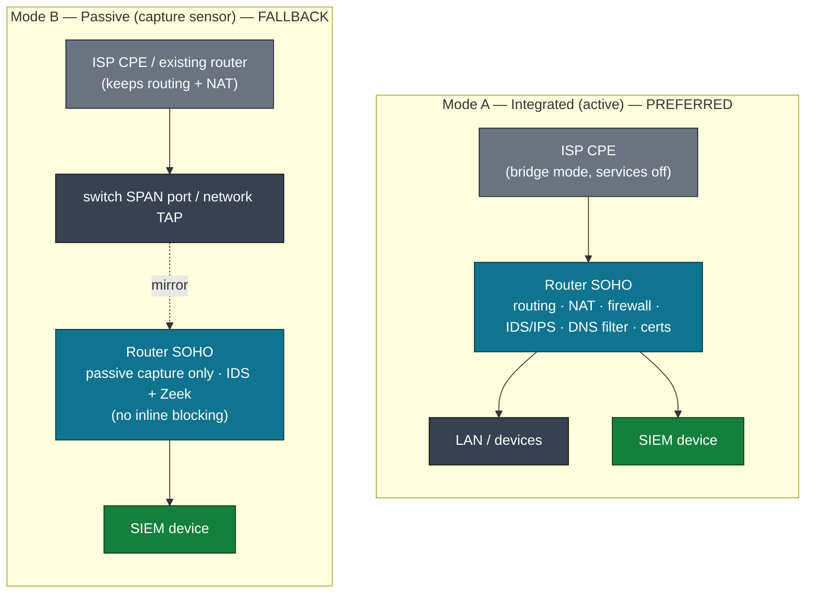

# 08 — Deployment Modes

The µSOC supports two perimeter deployment modes, chosen according to the level of
control available over the network's edge equipment, plus flexible hosting options
for the SIEM device. Regardless of the choices made, **all inter-component traffic
is encrypted** and the mandatory mutual-TLS is anchored by a single platform Root
CA.

---

## 1. Perimeter deployment modes



### Mode A — Integrated (active) — *preferred*

The Router SOHO (R_SOHO) **replaces** the perimeter router, or sits in front of an
ISP-provided device configured in **bridge mode**. All routing, firewall, IDS/IPS,
DNS filtering and certificate-management functions are concentrated in the Router
SOHO.

This is the preferred mode because it provides **full control over the network
perimeter** and enables the complete implementation of security policy — including
**active inline blocking** (Suricata IPS drops and pfBlockerNG enforcement at the
firewall).

### Mode B — Passive (capture sensor) — *fallback*

When replacing the existing router is not possible (for example, a proprietary ISP
CPE with no bridge option), the Router SOHO is connected to a **switch SPAN port**
or a **network TAP** and operates exclusively in **passive capture** mode. In this
configuration:

- Routing and NAT remain on the ISP device, whose services are reduced to the
  minimum (DNS and DHCP disabled where possible, firewall kept as strict as
  possible).
- The Router SOHO provides **visibility and IDS detection** (Suricata in IDS mode
  + Zeek telemetry) **without disrupting** the existing traffic flow or topology.

This mode has **limitations on active response** — it cannot drop malicious
traffic inline — but it **retains monitoring and alerting** through the SIEM
level. The SIEM device, optional EDR agents, and any AI functionality are deployed
identically regardless of whether the Router SOHO is active or passive.

---

## 2. SIEM hosting flexibility

Because of the µSOC's modular design, the SIEM device is **not topologically
constrained** to the monitored network's perimeter. It can be hosted in three
ways, chosen by operational requirements and available resources:

| Hosting | Description | Trade-off |
|---------|-------------|-----------|
| **Local (on-premises)** | SIEM runs on dedicated hardware or as a Docker/VM instance inside the SOHO network | **Preferred** — best for data minimization and processing latency |
| **Dedicated off-site** | SIEM hosted at a separate physical location (colocated server, or at a managed-service provider) | Reduces dependence on the availability of perimeter equipment |
| **Private / public cloud** | SIEM runs as a cloud instance (VPS, managed container) | Maximum resilience and accessibility, independent of local network state |

The last two modes are particularly relevant when the SOHO perimeter is
significantly affected — for example, during a major security incident, an attack
that compromises local infrastructure, or a connectivity outage at the edge. In
such situations, the µSOC's monitoring and detection remain operational
independently of the Router SOHO state, because the SIEM device continues to
receive telemetry from the EDR agents installed on the network's endpoints, **even
when the perimeter component is compromised or unavailable**.

### Encryption is mandatory in every hosting mode

Independent of where the SIEM device is hosted, data transfer between **all** µSOC
components — Router SOHO, optional EDR agents, and the SIEM device — occurs
**exclusively over encrypted channels**:

- Logs exported by the Router SOHO (via syslog-ng) are transmitted over **TCP with
  TLS (minimum TLS 1.2, recommended TLS 1.3)**, with **mutual certificate-based
  authentication**.
- EDR agents communicate with the SIEM device over **client-certificate
  authenticated** channels.
- For cloud hosting, telemetry may additionally be carried over a dedicated
  **VPN** or a secure proxy, eliminating public exposure of the SIEM's ingestion
  interface.

This end-to-end encryption requirement is **non-negotiable** in the µSOC and
applies uniformly across hosting modes, ensuring telemetry cannot be intercepted
or altered in transit.

---

## 3. Mapping to the reference implementation

In the open-source reference implementation, the four tiers are **layered defence
in depth**, so the deployment order follows the dependency chain — which is
deliberately **not** tier-1-first:

```text
1. Certificates  →  2. Tier 3 (SIEM)  →  3. Tier 4 (Operations)  →  4. Tier 1 (Perimeter)
```

- **Certificates first** — the single Root CA must exist before anything
  else, because every service certificate and the perimeter's mutual-TLS client
  certificate are signed by it. The single-Root-CA PKI lives in
  `tier4-operations/pki/` and underpins the mandatory mutual-TLS described above.
- **Tier 3 (SIEM device, `tier3-core/`)** is brought up next — the operations
  frontdoor proxies to it.
- **Tier 4 (operations / control plane, `tier4-operations/`)** brings up the
  frontdoor (the single LAN entry point) and monitoring.
- **Tier 1 (perimeter, `tier1-perimeter/`)** is configured last, because it ships
  logs *into* the already-running core.

The reference numbering (`tier1` … `tier4`) reflects the **architectural defence
layers**, not the deployment order. Full, step-by-step instructions —
prerequisites, environment variables, and per-tier verification — are in the
reference implementation's `INSTALL.md`.

> **Reference implementation (full, runnable code):**
> `github.com/cybrd0ne/suru-foss`

---

*Previous: [07 — Implementation mapping](./07-implementation-mapping.md)
 · Next: [09 — Scenarios & limitations](./09-scenarios-and-limitations.md)*
